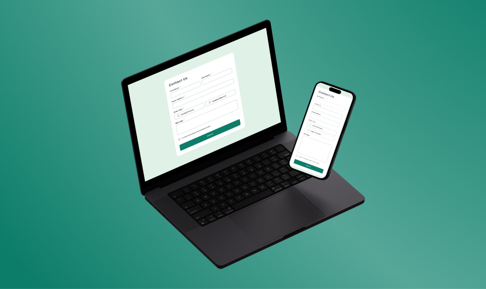

# Frontend Mentor - Contact form solution
  ## Overview
    This document provides detailed information about the Contact Page, including its design for both desktop and mobile, as well as the states (focus, hover, active, error) and functionalities.

    This is a solution to the [Contact form challenge on Frontend Mentor](https://www.frontendmentor.io/challenges/contact-form--G-hYlqKJj). Frontend Mentor challenges help you improve your coding skills by building realistic projects. 

  ## Table of contents

- [Frontend Mentor - Contact form solution](#frontend-mentor---contact-form-solution)
  - [Overview](#overview)
  - [Table of contents](#table-of-contents)
    - [The Features](#the-features)
    - [Screenshot](#screenshot)
    - [Links](#links)
  - [My process](#my-process)
    - [Built with](#built-with)
  - [Setup](#setup)


### The Features
Users should be able to:

- Complete the form and see a success toast message upon successful submission
- Receive form validation messages if:
  - A required field has been missed
  - The email address is not formatted correctly
- Have inputs, error messages, and the success message announced on their screen reader
- View the optimal layout for the interface depending on their device's screen size
- See hover and focus states for all interactive elements on the page

### Screenshot




### Links

- Live Site URL: (https://rhodalewi.github.io/Contact_Form_Main/)

## My process

### Built with

- Semantic HTML5 markup
- CSS custom properties
- JavaScript

## Setup

1. Clone the repository:
    ```sh
    git clone https://github.com/rhodalewi/Contact_Form_Main/tree/main
    ```
2. Navigate to the project directory:
    ```sh
    cd Contact_Form_Main
    ```
3. Open the `index.html` file in your web browser.
